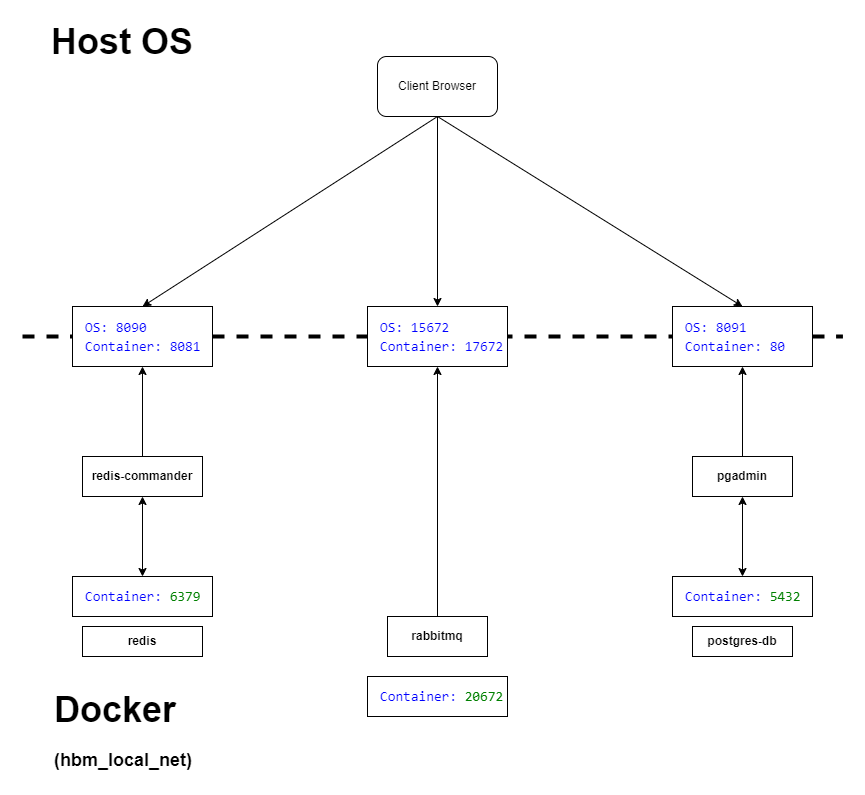
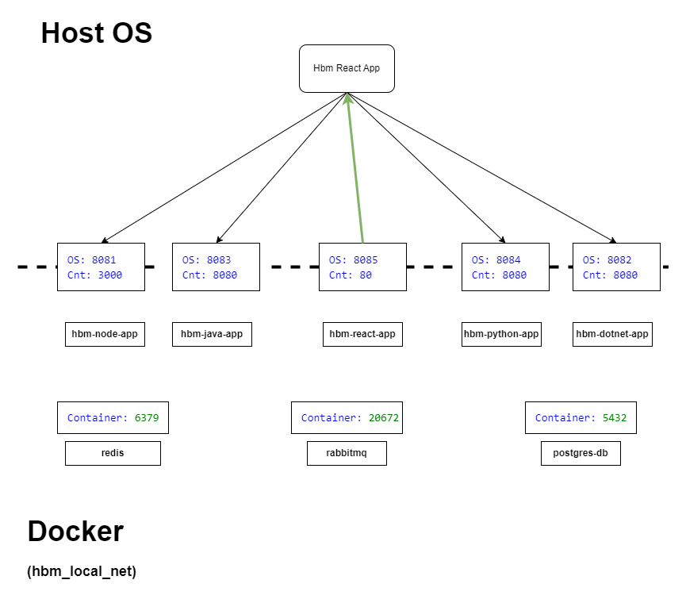
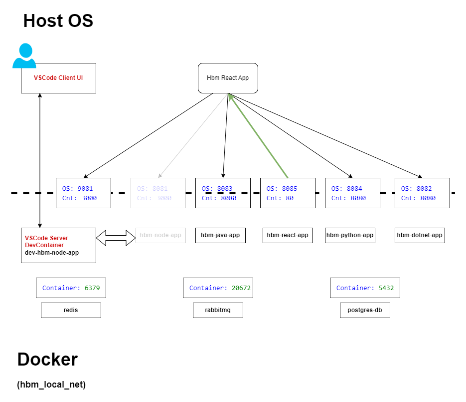

# Introduction 

Please meet the repository for "Docker for local development" workshop. It contains code samples demonstrating common development patterns and practices which leverages Docker tech, presented on workshop.

Covered topics / how-to's:

 - Manage application infrastructure on local machine;

 - Build and run application services locally (no IDE);

 - Debug application services in Docker container;

 - Cloud infrastructure emulated locally;

 - SDLC useful tools and utililities via Docker containers;

# Prerequisites

Following software is required to be installed locally.

- Docker CE/EE (Linux OS) or Docker Desktop (any OS);
- Visual Studio Code + DevContainers extension;

# Local app infrastructure




Our sample app infra consists of `Redis`, `PostgresDB` and `RabbitMQ`. Our infrastructure components are defined in `./src/hbm-app.infra.yml` file. Execute following commands to start the infra with Docker compose.

```
docker network create hbm_local_net
cd ./src
docker compose -f ./hbm-app.infra.yml -p hbm-app up -d
```

You should see the `hbm-app` compose project created with set of containers running under it. Follow (optional) setup steps to init infra further.

It is usually a good practice to provide management tools / web UI for your infra, if corresponded images are actually available. We set up managment UI images alongside our infra, so we can observe infra state from local machine without any further installments.


## Postgres DB

We've set up [PgAdmin](https://www.pgadmin.org/) along with PosgresDB instance.

1. Open `http://localhost:8091/`;
2. Enter any random string as admin password (you don't need it);
3. Click `Add New Server`;
4. Put anything you like into `Name` field, go to `Connection` tab and set it up with following params:
   - Host-name/address: postgres-db
   - password: postgres
   Leave everything else as-is and hit `Save`

You should see your newly-created connection to your local Postgres server. Feel free to dive in and play with it.

## Redis

We've set up [RedisCommander](https://github.com/joeferner/redis-commander) along with Redis instance.

1. Open `http://localhost:8090/`;
2. In top left corner, click `More => Add Server`;
3. Put anything you like into Display-Name;
4. Use `redis` as host-name;
5. Click `Connect`;

You should see your newly-created connection to your local Redis server.

## RabbitMQ

Our RMQ instance comes with built-in Management UI. You should be able to access it by following url `http://localhost:17672/`, using `guest:guest` as `username:password` pair.


# Local application services



Our sample app services are defined in `./src/hbm-app.core.yml` file.

Sample app consists of five containers/services: four Web API applications and font end React app to rule them all. In order to demostrate cross-platform/tech nature of the potential setup, each WebAPI app is implemented in different technology. I've chosen four most popular in HMB: Node (TypeScript), Python, .NET, Java.

Each WebAPI app implements following endpoints:
  - GET /env - responds with all OS environment variables as JSON;
  - GET /health - asserts connection to each infrastructure component and reports result as JSON;
  - POST /connect { "host" : string, "port" : string } - connects to another application within docker network (the "host" and "port" are resolved according to  )

You actually don't need an IDE or any additional setup to run `Dockerized` application on your local machine. Let's build and run our app core services:

```
cd ./src
docker compose -f ./hbm-app.core.yml -p hbm-app up -d
```

You should see the `hbm-app` compose project populated with additonal services, all starting with `hbm-*` prefix. These are our apps. Go ahead, open `http://localhost:8085/` (the frontend React one) and play with other apps by calling their endpoints. Feel free to observe logs, shut down infra to emulate network partioning and other disasters, etc.


# Debug application services in Docker container



Although seem simple on the first glance, debbugging is a complex topic. Its actual implementation depends on many factors, including your OS, technology, IDE and lots of other things. Since docker provides its own degree of isolation from the host OS, debugging of the Docker-containerized apps could be seen as a form of remote debugging. Usually it is either your IDE connects to the app which runs "debug mode" in conatiner through certain form of tunnelling, or your IDE works in client-server mode, where "server" runs the app in debug mode in container. Generally, there are a number of technologies on the market, and you should find the one which best fits your ecosystem and toolset.

However, despite all the variations mentioned above, the core idea of the app, running in debug mode in container, remains. No matter the technology, the prosed debug pattern is following:

  1. Find the container you would like to debug among "Local app service" containers. Turn it off;
  2. Make sure your IDE starts app Docker conatiner with configuration, identical to the config of the corresponded service from the "Local app service" section;
  3. Make sure the "debug" container is created within the same network, with the same host name and network alias; this guarantees that the other apps within network see your conatiner as the original one, turned off in point #1.

Voila, now you have your app running in debug mode, and still being a part of your app infra, having other apps running in containers!

## Debug with VSCode + DevContainers

[DevConatiners](https://github.com/devcontainers) is among the technologies providing containerized app debug experience. In combination with VS Code it grants you cross-platform, ecosystem-agnostic, extensible IDE, thus I decided to take this pair for the demo purpose.

You can find VS Code extension here: https://marketplace.visualstudio.com/items?itemName=ms-vscode-remote.remote-containers .
DevConatiners website [declares support for IntelliJ and VisualStudio](https://containers.dev/supporting), thus it might play well with your toolset.

### Debugging the app(s)

1. Install VSCode  DevConatiners extension

2. Run following in terminal:
```
cd ./src/<the-app-to-be-debugged>
code .
```

3. The new instance of VSCode should pop up. DevContainers plugin should detect the .devcontainers folder and pop-up should appear, suggesting reopening folder in DevContainer. Choose `Reopen In Container` option and wait for the container to be fully initialized.

4. Press F5 and watch your app starting in debug mode;

5. (optional) Shut down corresponded app container, created with "Local application services" compose file;

6. Put some breakpoints and call the endpoints using web UI in React app. Enjoy debugging!

Note: you can also try debugging the React app. Despite running in browser, DevContainers + VSCode manages to keep the same seamless debug experience, granting you ability to navigate the source code via IDE.


# Cloud infrastructure emulated locally

Apart from the generic infrastructure, there are Docker images which implement various cloud emulators. You can try those in case you need a specific cloud functionality on your local machine and wouldn't like to deal with shared / developer-specific instances resiing on cloud. Let's add Azurite (Azure) and Localstack (AWS) emulators to our infra:

```
cd ./src
docker compose -f ./hbm-app.emulators.yml -p hbm-app up -d
```

Both of those guys are subject for dedicated workshop, so we won't dive deep into them. Simply keep in mind that if you need cloud infra components for your integration tests or local development - you may consider using emulator instead of actual cloud resource.


# SDLC useful tools and utililities via Docker containers

You can also benefit from Docker usage on any OS by leveraging vast amount of Linux utils. Let's start with an example - here comes the script which does the healthcheck of our app by using "swiss army knife" netwrok diagnostic docker image:

```
cd ./src
docker run -it --rm --network=hbm_local_net -v ${pwd}/check_me.sh:/check_me.sh:ro nicolaka/netshoot /bin/bash /check_me.sh
```

## Docker tools

Among use cases are:

- networking troubleshoot / diagnostics
   - https://hub.docker.com/r/nicolaka/netshoot

- benchmarking (e.g. apache ab)
   - `docker run --rm jordi/ab -v 2 https://www.docker.com/`

- processing tools (jq | curl | wget | bash | etc)

- database utils (for complex migrations)
   - https://hub.docker.com/r/microsoft/mssql-tools
   - https://hub.docker.com/r/pygmy/pgcli

- repeatable local builds (aka local CI/CD, if necessary)

- data seeding / injestion
   - produce/consume Kafka/RMQ messages
   - bash scripts to seed db

- cli for cloud providers
   - https://hub.docker.com/r/microsoft/azure-cli
   - https://hub.docker.com/r/amazon/aws-cli
   - https://hub.docker.com/r/google/cloud-sdk


## Docker compose projects

You can also play with local setups of popular software platforms and composite setups using ready-made compose projects.

- https://github.com/docker/awesome-compose
- https://github.com/bitnami/containers/tree/main?tab=readme-ov-file#run-the-application-using-docker-compose
- ... to be continued :) .
